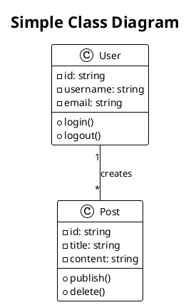

# 🎨 UML Diagram Studio

<div align="center">

**A modern, AI-powered online tool for creating professional UML diagrams with ease**

[](https://opensource.org/licenses/MIT)
[](https://nextjs.org/)
[](https://www.typescriptlang.org/)
[](https://reactjs.org/)

[Live Demo](#) • [Documentation](#) • [Report Bug](#) • [Request Feature](#)

</div>

---

## ✨ Overview

**UML Diagram Studio** is a cutting-edge, free online tool designed to help developers, software architects, and technical professionals create professional UML (Unified Modeling Language) diagrams effortlessly. Our platform combines the power of AI-assisted code generation with real-time diagram preview, making it the go-to solution for visualizing software architecture, system designs, and complex workflows.

Whether you're working on class diagrams, sequence diagrams, activity diagrams, or state diagrams, UML Diagram Studio provides an intuitive interface that supports PlantUML syntax. Our AI-powered assistant can help you generate diagram code from natural language descriptions, significantly reducing the time and effort required to create comprehensive UML diagrams.

## 🚀 Key Features

### 🎯 Core Capabilities

- **🤖 AI-Powered Code Generation** - Generate UML diagram code from natural language using advanced AI models
- **⚡ Real-Time Preview** - See your diagrams update instantly as you type with live rendering
- **📝 Syntax Support** - Full support for PlantUML syntax with syntax highlighting
- **📚 Template Library** - Access a curated collection of pre-built diagram templates
- **💾 Auto-Save** - Your work is automatically saved to localStorage
- **📤 Export Options** - Download your diagrams as PNG or SVG files
- **🎨 Modern UI** - Clean, developer-focused design inspired by VS Code and Linear
- **🌓 Dark Mode** - Beautiful dark and light themes with smooth transitions
- **📱 Responsive Design** - Works seamlessly on desktop and tablet devices

### 🛠️ Advanced Features

- **Resizable Panels** - Customize your workspace with draggable panel dividers
- **Monaco Editor** - Professional code editor with syntax highlighting and IntelliSense
- **Chat Assistant** - Interactive AI sidebar for diagram generation and assistance
- **Error Detection** - Real-time error highlighting and validation
- **Zoom Controls** - Adjust diagram view with zoom and pan functionality
- **Template Categories** - Organized templates for Class, Sequence, Activity, State, and Use Case diagrams

## 🎬 Getting Started

### Prerequisites

- Node.js 18+ and npm/yarn/pnpm
- An OpenAI API key (for AI features) - [Get one here](https://platform.openai.com/api-keys)

### Installation

1. **Clone the repository**
   ```bash
   git clone https://github.com/mubashir-ullah/UML-Diagram.app.git
   cd UML-Diagram.app
   ```

2. **Install dependencies**
   ```bash
   npm install
   # or
   yarn install
   # or
   pnpm install
   ```

3. **Set up environment variables**
   
   Create a `.env.local` file in the root directory:
   ```env
   OPENAI_API_KEY=your_openai_api_key_here
   OPENAI_MODEL=gpt-3.5-turbo  # Optional, defaults to gpt-3.5-turbo
   ```

4. **Run the development server**
   ```bash
   npm run dev
   # or
   yarn dev
   # or
   pnpm dev
   ```

5. **Open your browser**
   
   Navigate to [http://localhost:3000](http://localhost:3000)

### Building for Production

```bash
npm run build
npm start
```

## 📖 Usage Guide

### Creating Your First Diagram

1. **Start with a Template**
   - Click the template selector in the top bar
   - Choose from categories like Class Diagrams, Sequence Diagrams, etc.
   - The template code will be inserted into the editor

2. **Edit the Code**
   - Use the left panel code editor to modify PlantUML syntax
   - See real-time preview in the center panel
   - Your changes are auto-saved

3. **Use AI Assistant**
   - Click the chat icon to open the AI sidebar
   - Describe the diagram you want in natural language
   - The AI will generate PlantUML code for you
   - Click "Insert to Editor" to use the generated code

4. **Export Your Diagram**
   - Use the export buttons in the top bar
   - Choose PNG for raster images or SVG for vector graphics
   - Your diagram will download automatically

### Example PlantUML Code



## 🏗️ Project Structure

```
UML-Diagram.app/
├── app/                    # Next.js app directory
│   ├── about/             # About page
│   ├── api/               # API routes
│   │   ├── chat/          # AI chat endpoint
│   │   ├── compile/       # Diagram compilation
│   │   ├── export/        # Export functionality
│   │   └── templates/     # Template API
│   └── page.tsx           # Main application page
├── components/             # React components
│   ├── chat-sidebar.tsx   # AI chat interface
│   ├── code-editor.tsx    # Monaco editor wrapper
│   ├── diagram-preview.tsx # Diagram renderer
│   ├── top-bar.tsx        # Navigation bar
│   └── ui/                # shadcn/ui components
├── lib/                    # Utility libraries
│   ├── ai.ts              # AI integration
│   ├── templates.ts       # Diagram templates
│   └── utils.ts           # Helper functions
├── shared/                 # Shared types and schemas
│   └── schema.ts          # Zod schemas and types
└── public/                 # Static assets
```

## 🛠️ Tech Stack

### Frontend
- **[Next.js 14](https://nextjs.org/)** - React framework with App Router
- **[React 18](https://reactjs.org/)** - UI library
- **[TypeScript](https://www.typescriptlang.org/)** - Type safety
- **[Tailwind CSS](https://tailwindcss.com/)** - Styling
- **[shadcn/ui](https://ui.shadcn.com/)** - Component library
- **[Monaco Editor](https://microsoft.github.io/monaco-editor/)** - Code editor
- **[Framer Motion](https://www.framer.com/motion/)** - Animations

### Backend & AI
- **[OpenAI API](https://platform.openai.com/)** - AI-powered code generation
- **[PlantUML](http://plantuml.com/)** - Diagram rendering engine
- **[Drizzle ORM](https://orm.drizzle.team/)** - Database toolkit

### Development Tools
- **[ESLint](https://eslint.org/)** - Code linting
- **[Prettier](https://prettier.io/)** - Code formatting
- **[Zod](https://zod.dev/)** - Schema validation

## 🎨 Design Philosophy

UML Diagram Studio follows a modern developer productivity tool design, inspired by:
- **Linear** - Clean, focused interface
- **VS Code** - Familiar developer experience
- **Cursor** - AI-first interactions

The design prioritizes:
- ⚡ **Efficiency** - Fast, responsive interactions
- 🎯 **Clarity** - Clear visual hierarchy
- 💼 **Professionalism** - Polished, production-ready aesthetics

## 🤝 Contributing

Contributions are welcome! Whether it's:
- 🐛 Bug fixes
- ✨ New features
- 📝 Documentation improvements
- 🎨 UI/UX enhancements
- 🔧 Performance optimizations

### How to Contribute

1. Fork the repository
2. Create your feature branch (`git checkout -b feature/AmazingFeature`)
3. Commit your changes (`git commit -m 'Add some AmazingFeature'`)
4. Push to the branch (`git push origin feature/AmazingFeature`)
5. Open a Pull Request

Please make sure your code follows the existing style and includes tests if applicable.

## 📝 License

This project is licensed under the MIT License - see the [LICENSE](LICENSE) file for details.

## 👤 Author

**Mubashir**

- GitHub: [@mubashir-ullah](https://github.com/mubashir-ullah)
- LinkedIn: [Mubashir Ullah](https://www.linkedin.com/in/mubashir-ullah/)

## 🙏 Acknowledgments

- [PlantUML](http://plantuml.com/) for the powerful diagram syntax
- [shadcn](https://ui.shadcn.com/) for the beautiful component library
- [OpenAI](https://openai.com/) for enabling AI-powered features
- The open-source community for inspiration and support

## 📚 Resources

- [PlantUML Documentation](https://plantuml.com/guide)
- [Next.js Documentation](https://nextjs.org/docs)
- [TypeScript Handbook](https://www.typescriptlang.org/docs/)

## 💬 Support

If you have any questions, suggestions, or need help:

- 📧 Email: contact@umldiagramstudio.com
- 🐛 [Open an Issue](https://github.com/mubashir-ullah/UML-Diagram.app/issues)
- 💡 [Request a Feature](https://github.com/mubashir-ullah/UML-Diagram.app/issues/new)

---

<div align="center">

**Made with ❤️ by [Mubashir](https://github.com/mubashir-ullah)**

⭐ Star this repo if you find it helpful!

</div>

